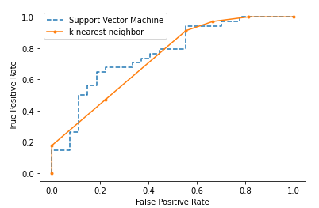
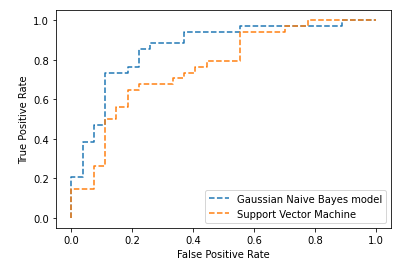
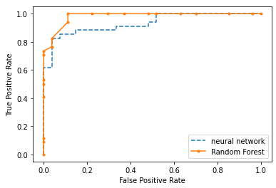
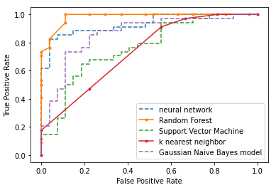
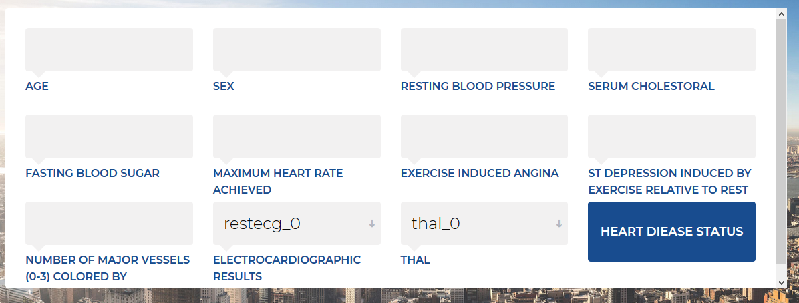

# heart-disease-prediction-ML-
compare the performance of 5 different classifiers using heart disease data and with the help of best classifier we implement the heart disease prediction system

# evaluation of the generalised predictive ability of five machine learning algorithms across heart disease  data sets 

 In this project ,I used the support vector machine,k nearest neighbor,random forest classifier,gaussian naive bayes classifier and artificial  neural network classifier to predict the heart diagnosis, and then compare the above classifier based on the confused matrix and area under the curves.

# Introduction

Heart disease is increasingly being used in the clinical setting to identify the deise based on the existing data set  . Machine learning algorithms are  the useful tools to predict heart disease from existing data sets and One of the core tasks in building a machine learning model for predicting heart disease  is to evaluate its performance.
To predict heart disease based on the training model, it is important to select the best model among the set of models. And therefore it is better to train each model and identify the best model based on Evaluation Metrics. Different machine learning tasks have different performance metrics. I build a set of classifiers to detect heart disease patients versus normal, then I can use classification performance metrics such as average accuracy, and area under the curve (AUC).
The aim of this project was to compare the performance of the five different machine learning classifiers and evaluate them on clinical heart disease data sets. We used the linear classifier such as random forest and support vector machines and non-linear classifiers such as k nearest neighbor,naive Bayes and Artificial neural network.

# dataset 

The Data: Heart Disease Data Set („The Cleveland Database“)(see https://archive.ics.uci.edu/ml/datasets/Heart+Disease)
This database contains 76 attributes, but all published experiments refer to using a subset of 14 of them. In particular, the Cleveland database is the only one that has been used by Machine learning algorithms to predict the presence of heart disease.

# Method 

# Machine learning algorithms

We use the following five machine learning methods were considered for this project:

support vector machine
k nearest neighbor
random forest classifier
gaussian naive bayes classifier 
artificial  neural network 

we used the scikit-learn library to implement the project

# Result

What is AUC - ROC Curve?

AUC - ROC curve is a performance measurement for classification problem at various thresholds settings. ROC is a probability curve and AUC represents degree or measure of separability. It tells how much model is capable of distinguishing between classes. Higher the AUC, better the model is at predicting 0s as 0s and 1s as 1s. By analogy, Higher the AUC, better the model is at distinguishing between patients with heart disease and no disease.

An excellent model has AUC near to the 1 which means it has good measure of separability. A poor model has AUC near to the 0 which means it has worst measure of separability. In fact it means it is reciprocating the result. It is predicting 0s as 1s and 1s as 0s. And when AUC is 0.5, it means model has no class separation capacity whatsoever.

compare the performance of support vector machine vs k-nearest neighbor

 
 
 compare the performance of support vector machine vs gaussian naive bayes
 
 
 
 compare the performance of Naive Bayes classifier vs Random Forest
 
  
 
 compare the performance of Artificial neural network vs Random Forest
 
  

compare the performance among 5 different classifiers

  

# further work

I developed the graphical user interface to predict the heart disease from the user input with the help of flask framework, the user interface  was developed  by HTML, CSS, jquery, and backend was implemented by python.

  
